# 傻瓜式攻略

**请使用电脑端完成所有操作**

完成本配置后，服务将在同一个 MCP 端点下同时支持 Scopus、ArXiv、PubMed 与 Google Scholar 工具。
Google Scholar 相关链路可能不稳定或暂时不可用，因此该部分能力属于测试性内容。

## 1、申请 Elsevier API Key（用于 Scopus 等服务）

前往这个网址进行API Key的申请

https://dev.elsevier.com/

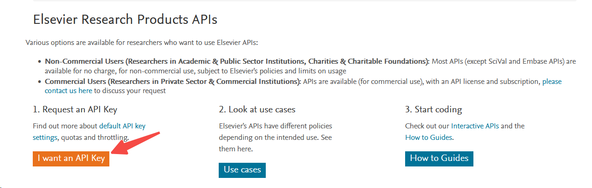

注意：你需要使用一个教育邮箱注册，并且需要进行对应教育机构的身份验证；获得的 API Key 请勿泄露，否则可能被他人滥用。Scopus 是 Elsevier 旗下数据库，该 Key 本质为 Elsevier API Key，在订阅权限与密钥作用域允许时也可用于其他 Elsevier API 服务。

## 2、下载cherrystudio

前往这个网站下载cherrystudio的电脑版：https://www.cherry-ai.com/

打开后会发现模型已经默认配置了一个免费的GLM模型。

在设置里进入MCP服务器选项卡：

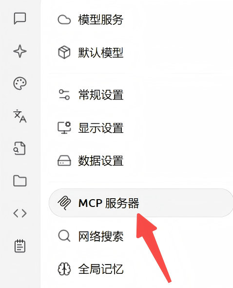

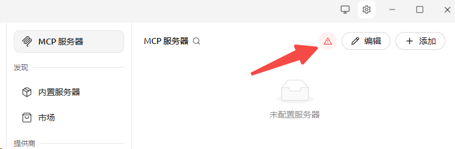

在初次启动时，右上角会出现一个警告标志，**请务必点击它以安装必要的依赖项目**。

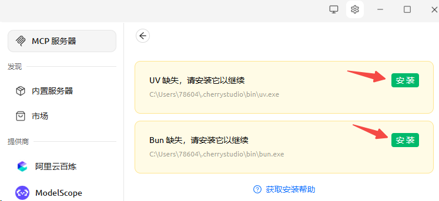

点击安装，等待安装完成。

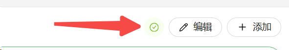

**必须保证此处的图标变为“√”**，此处如果出现任何依赖安装的问题，请移步cherrystudio的项目界面提交issue。

## 3、导入json文件

点击右上角“添加”，选择“从json导入”，将下面的“咒语”输入其中，注意把第一步得到的KEY替换到其中；

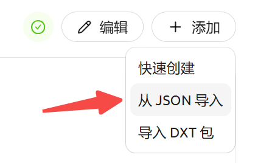

```json
{
  "mcpServers": {
    "uniarticles-mcp-server": {
      "command": "uvx",
      "args": [
        "--refresh", 
        "uniarticles-mcp"
      ],
      "env": {
        "SCOPUS_API_KEY": "your_elsevier_api_key_here",
      }
    }
  }
}
```

**请注意这段json代码的缩进！！任何不恰当的缩进都可能导致服务器导入的失败！！！**


**如果您暂时不持有任何API Key**，则改为输入以下token：

```json
{
  "mcpServers": {
    "uniarticles-mcp-server": {
      "command": "uvx",
      "args": [
        "--refresh",
        "uniarticles-mcp"
      ],
      "env": {
      }
    }
  }
}
```

然后，点击此处启动服务；

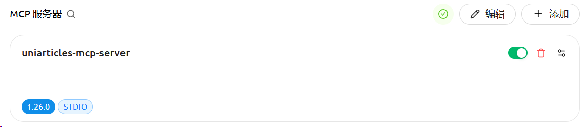

必须保证左下角显示出了“1.X”的版本号，如果只有"STDIO"标识，说明服务没有被正确启动，建议删除后重新导入

## 4、开始聊天

最后，回到对话界面，启用“对话时调用MCP服务器”功能：

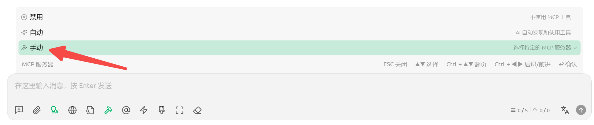

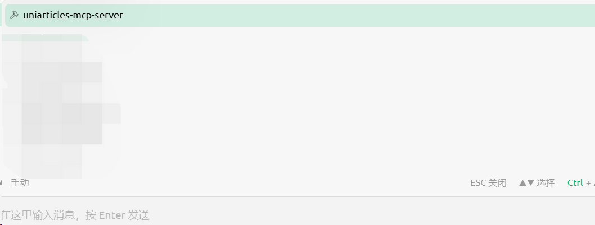

然后就可以开始要求AI去查文献了！

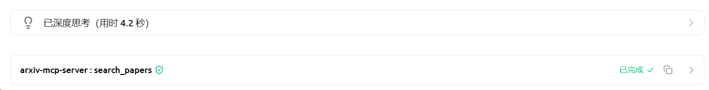

如果在这里出现了MCP服务器的名字，证明工具被正常调用了；**如果没有，即使AI最后给出了一些宣称在Scopus查询到的文献，也大概率是AI所编造的，无法保证真实性。**

如果AI没有意识到需要调用这个工具，可以在提示词里强调 `利用MCP工具在各大数据库里查询`

点开”>“按钮，可以发现大模型本质上就是向数据库发送了一条查询请求——query是请求主题（包括"molecular fingerprint"），count是查询数量，以及一些其他参数。

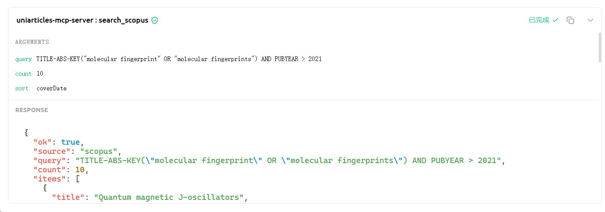

因此，**AI从中获取的文献是直接来自对数据库的查询，一定是真实无误的**，它将彻底解决AI查询文献时的幻觉问题。
