# Step-by-Step Configuration Guide

**Please perform all operations on a computer.**

I'm sorry that some of the pictures are in Chinese. If you have any questions, please feel free to ask.

After this configuration, the server exposes Scopus, ScienceDirect, arXiv, PubMed, Crossref, Europe PMC, DOAJ, OpenAIRE and CORE (**9 data sources / 21 tools**) through one unified MCP endpoint.
Google Scholar is no longer part of this project — it was removed in v2.1.0.

## 1. Apply for Elsevier API Key (for Scopus, ScienceDirect, and more)

Go to the following website to apply for an API Key:

https://dev.elsevier.com/

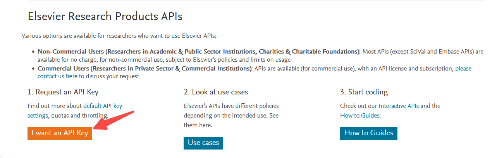

Note: a **personal** Elsevier Developer account is enough — no institutional subscription and no Insttoken is required for any tool in this server. Do not disclose the obtained API Key, as it may be misused by others. Scopus and ScienceDirect are Elsevier databases, and this key can also be used for other Elsevier APIs if your subscription and key scope allow it.

## 2. Download Cherry Studio

Go to this website to download the PC version of Cherry Studio: https://www.cherry-ai.com/

After opening it, you will find that a free GLM model is already configured by default.

Go to the MCP Servers tab in Settings:

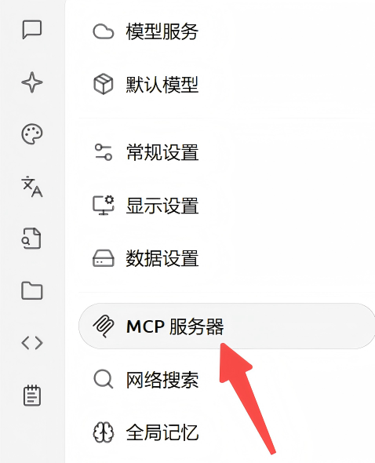

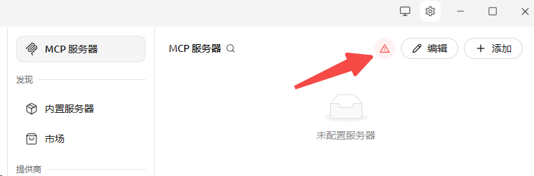

On first launch, a warning sign will appear in the top right corner. **Please make sure to click it to install necessary dependencies.**

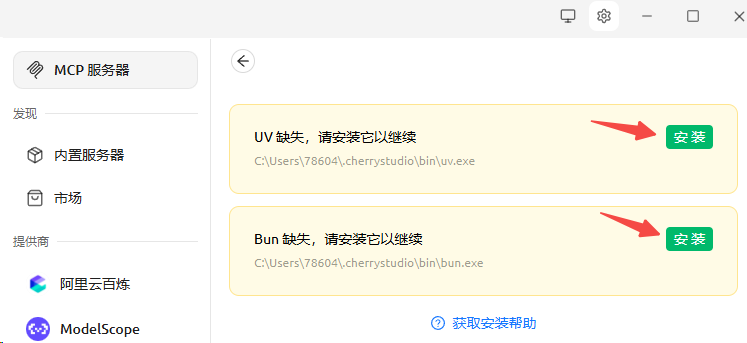

Click install and wait for the installation to complete.

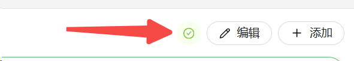

**You must ensure the icon here turns into a "√".** If any dependency installation issues occur here, please go to the Cherry Studio project page to submit an issue.

## 3. Import JSON File

Click "Add" in the top right corner, select "Import from JSON", and enter the "spell" below. Note that you should replace the KEY obtained in step 1 into it:

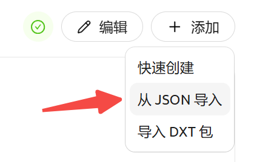

```json
{
  "mcpServers": {
    "uniarticles-mcp-server": {
      "command": "uvx",
      "args": [
        "--refresh",
        "uniarticles-mcp"
      ],
      "env": {
        "ELSEVIER_API_KEY": "your_elsevier_api_key_here",
        "NCBI_API_KEY": "your_ncbi_api_key_here",
        "CORE_API_KEY": "your_core_api_key_here"
      }
    }
  }
}
```

**Please pay attention to the indentation of this JSON code!! Any improper indentation may cause the server import to fail!!!**

Only `ELSEVIER_API_KEY` is required; the other two fields are **optional**. If you don't have a given key, **delete that entire line** (JSON does not allow comments, and the last remaining line inside `env` must not end with a comma):
- `NCBI_API_KEY` — PubMed works without it; a key only raises the rate limit from 3 to 10 requests/sec. Free: sign in at https://www.ncbi.nlm.nih.gov/ and create one at https://account.ncbi.nlm.nih.gov/settings/
- `CORE_API_KEY` — CORE works without it but is heavily rate-limited; a key is recommended. Free: https://core.ac.uk/services/api#form

**If you do not currently hold any API Key**, enter the following token instead:

```json
{
  "mcpServers": {
    "uniarticles-mcp-server": {
      "command": "uvx",
      "args": [
        "--refresh",
        "uniarticles-mcp"
      ],
      "env": {
      }
    }
  }
}
```

Then, click here to start the service:

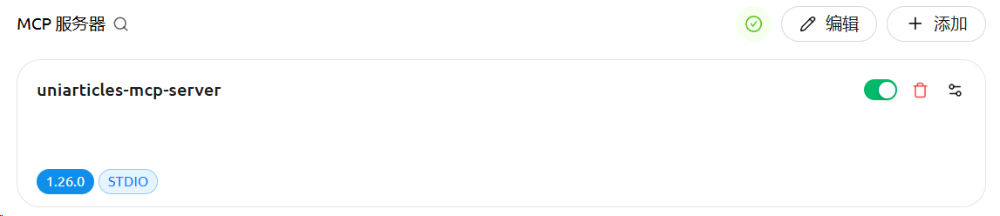

You must ensure that a version number like "1.X" appears in the bottom left corner. If only the "STDIO" label is shown, it means the service was not started correctly. It is recommended to delete and re-import.

## 4. Start Chatting

Finally, return to the chat interface and enable the "Call MCP Servers during chat" function:

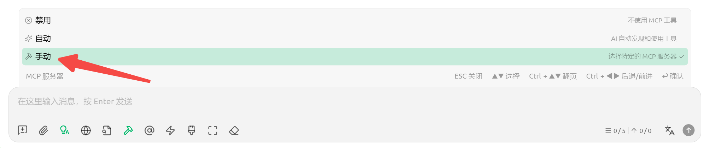

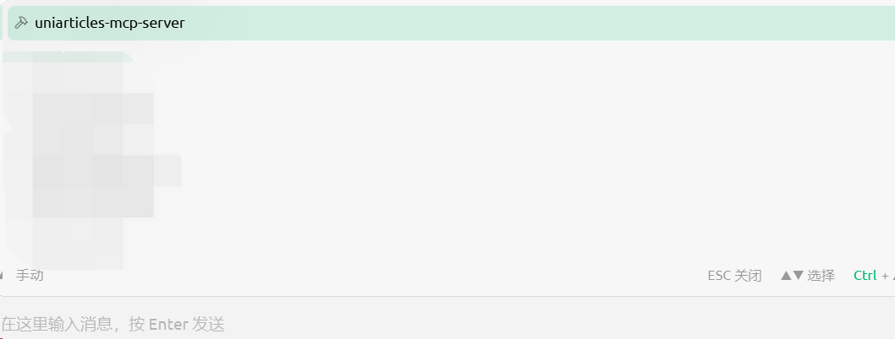

Then you can ask the AI to search for literature!

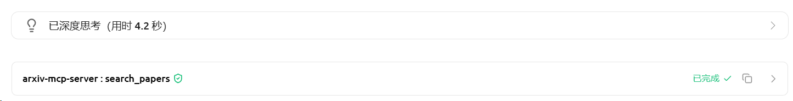

If the MCP server name appears here, it proves the tool was called normally. **If not, even if the AI claims to have found some literature in Scopus, it is likely fabricated by the AI and its authenticity cannot be guaranteed.**

If the AI doesn't realize it needs to call this tool, you can emphasize in the prompt: `Use MCP tools to search in major databases`.

Click the ">" button to see that the large model essentially sent a query request to the database—query is the request topic (including "molecular fingerprint"), count is the number of queries, and some other parameters.

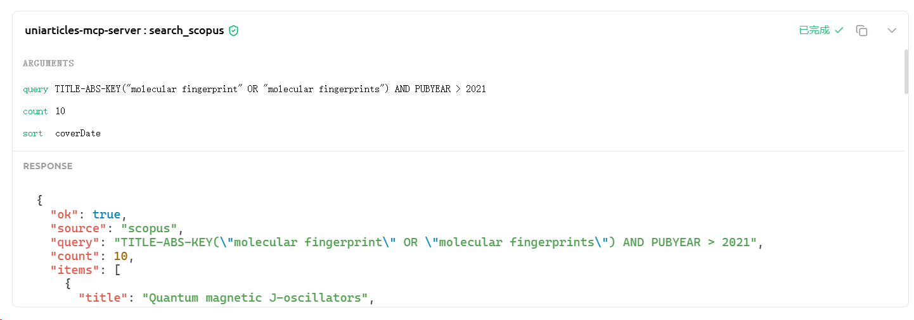

Therefore, **the literature obtained by the AI comes directly from the database query and must be authentic.** It will completely solve the hallucination problem when AI searches for literature.
